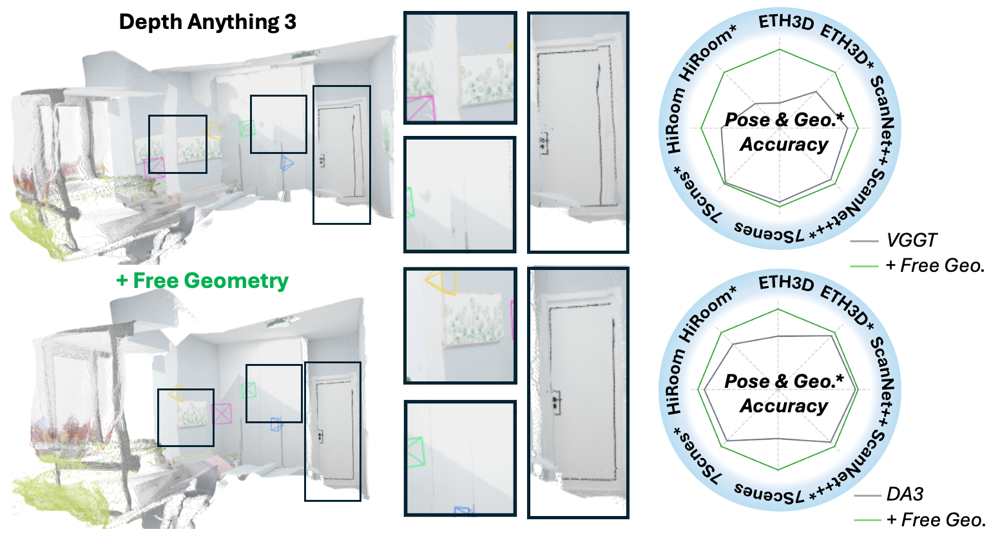
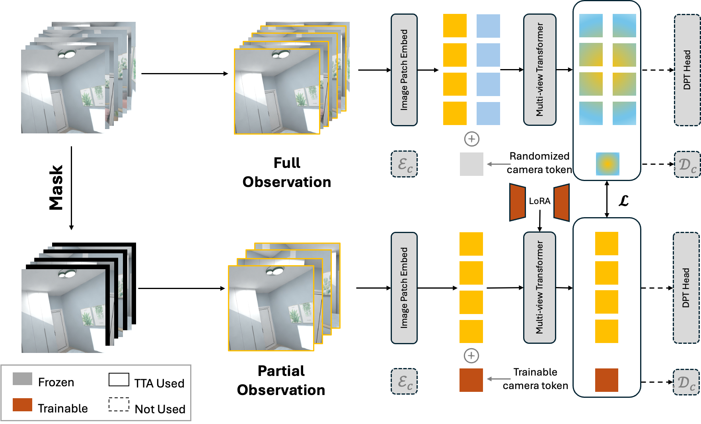
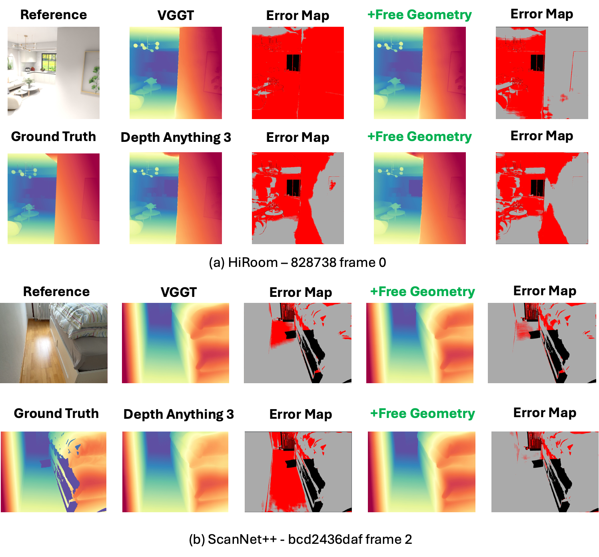
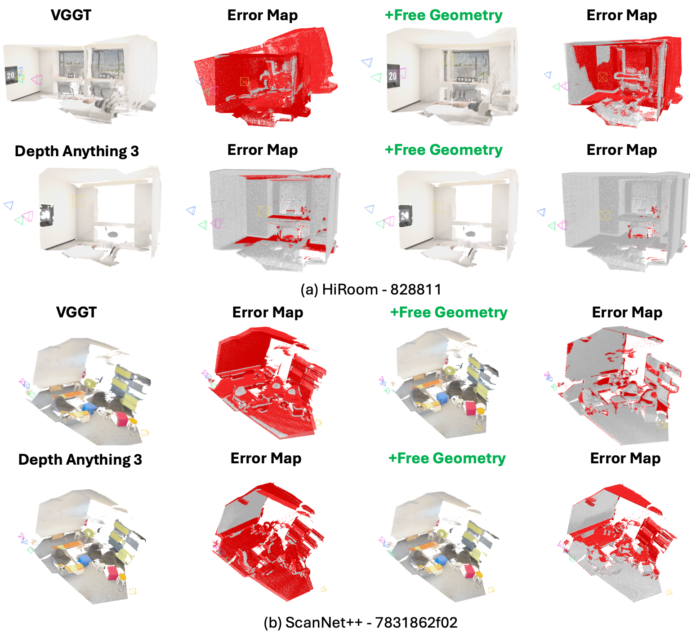
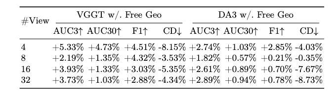

<div align="center">

<h1 style="text-align:center;">
Free Geometry: Refining 3D Reconstruction from Longer Versions of Itself
</h1>

_Test-time self-evolution for feed-forward 3D reconstruction without 3D ground truth_

<p align="center">
  <a href="https://arxiv.org/abs/2604.14048" target="_blank">
    
  </a>
  <a href="https://github.com/hiteacherIamhumble/Free-Geometry" target="_blank">
    
  </a>
  <a href="https://huggingface.co/PeterDAI/Free-Geometry" target="_blank">
    
  </a>
  <a href="./LICENSE" target="_blank">
    
  </a>
</p>

</div>

## 🔄 Updates
- **2026.04.15:** The Free Geometry paper and code were released.

## 📦 What This Repo Provides

| Component | Description |
| --------- | ----------- |
| **Free Geometry Training** | Test-time self-supervised adaptation pipelines for **Depth Anything 3 (DA3)** and **VGGT** via lightweight LoRA updates |
| **Benchmark Scripts** | Single-model evaluation entry points for camera pose and reconstruction benchmarking |
| **All-In-One Runners** | Reproducible shell runners for training, baseline benchmarking, LoRA benchmarking, and full end-to-end workflows |
| **Shared Multiview Evaluation** | A unified multiview benchmark pipeline across datasets and view counts |
| **Visualization Tools** | Result visualizer for comparing baseline and Free Geometry outputs from a shared `results/` root |
| **Inference / App Utilities** | CLI and Gradio-oriented utilities for image, video, and COLMAP-based 3D reconstruction workflows |

## 📝 Overview

Feed-forward 3D reconstruction models are efficient, but they are also rigid: once trained, they normally run in a zero-shot manner and cannot adapt to the scene they are currently reconstructing. In practice, that leaves visible errors under occlusion, specular surfaces, and other ambiguous visual conditions.

**Free Geometry** addresses this with a simple idea: reconstructions produced from **more views** are often more reliable than reconstructions produced from fewer views. The framework turns that property into a self-supervised test-time adaptation signal by masking part of an input sequence, enforcing cross-view feature consistency between full and partial observations, and preserving the pairwise geometric relations implied by held-out frames. This makes it possible to refine foundation reconstruction models with lightweight **LoRA** updates, without using any 3D ground truth at test time.

The current repository is the active Free Geometry workflow for **DA3** and **VGGT**, including training scripts, benchmarking scripts, multiview evaluation, and visualization utilities.

## 🌟 Why Free Geometry?

<p align="center">
  
</p>

The core benefit of Free Geometry is that it improves scene-specific reconstructions using only the test sequence itself. Instead of relying on external labels or expensive optimization-heavy reconstruction pipelines, it uses longer-view consistency as supervision and adapts quickly through low-rank updates. According to the arXiv paper, this refinement takes **less than 2 minutes per dataset on a single GPU** and improves both pose accuracy and point-map quality across four benchmarks.

## 🧠 Free Geometry Pipeline

<p align="center">
  
</p>

Free Geometry builds a self-supervised task from a testing sequence by comparing reconstructions from **full observations** against reconstructions from **partial observations**. The training objective combines cross-view feature consistency with constraints that preserve the geometry implied by the held-out views. In this repository, that logic is exposed through dedicated DA3 and VGGT training scripts, LoRA checkpointing, and matching benchmark pipelines.

## 📊 Qualitative Results

<p align="center">
  
</p>

<p align="center">
  
</p>

<p align="center">
  
</p>

The paper reports consistent gains on four benchmark datasets, with an average improvement of **3.73%** in camera pose accuracy and **2.88%** in point-map prediction. The qualitative figures above highlight the intended effect of Free Geometry: cleaner depth structure, more stable geometry, and improved multiview consistency after adaptation.

## 📚 Usage

Environment setup, training, and benchmarking commands are documented in [docs/scripts.md](docs/scripts.md).

## 🎬 Demo

### Free Geometry visualization

```bash
python scripts/visualize_free_geometry.py \
  --model_family da3 \
  --dataset hiroom \
  --frames 16 \
  --seed 43 \
  --results_root results \
  --host 127.0.0.1 \
  --port 7860
```

This opens the Gradio demo used for comparing baseline and Free Geometry outputs.

### DA3 Gradio app

```bash
python -m depth_anything_3.cli gradio \
  --model-dir <MODEL_DIR> \
  --workspace-dir workspace/gradio \
  --gallery-dir workspace/gallery \
  --host 127.0.0.1 \
  --port 7860
```

This launches the interactive DA3 demo.

## 🙏 Acknowledgement

Free Geometry is built around adapting strong feed-forward 3D reconstruction backbones, especially **Depth Anything 3** and **VGGT**. This repository also depends on the broader open-source 3D vision ecosystem, including packages such as **gsplat**.

## 📚 Citation

If you find Free Geometry useful, please consider citing the paper:

```bibtex
@misc{dai2026freegeometryrefining3d,
  title={Free Geometry: Refining 3D Reconstruction from Longer Versions of Itself},
  author={Dai, Yuhang and Yang, Xingyi},
  year={2026},
  eprint={2604.14048},
  archivePrefix={arXiv},
  url={https://arxiv.org/abs/2604.14048}
}
```
